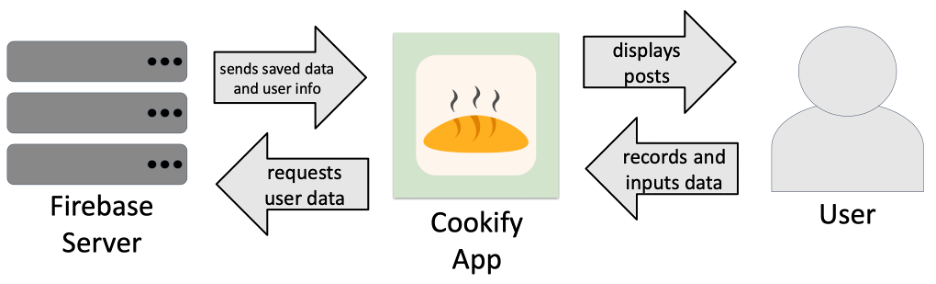
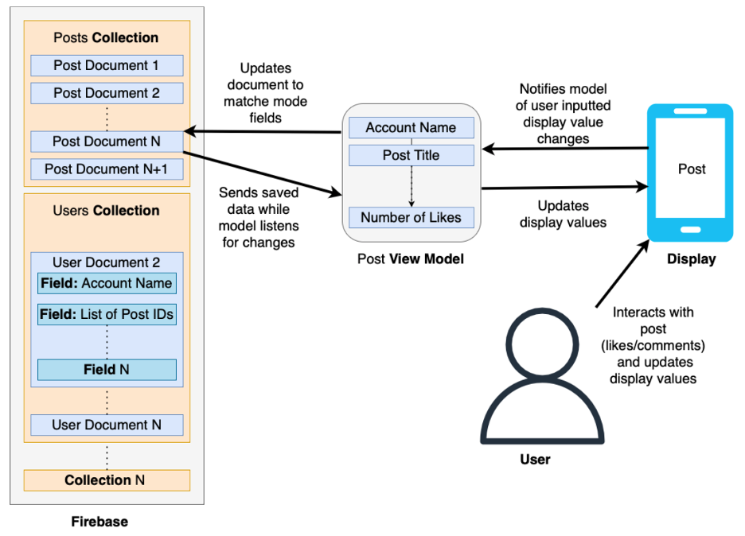

# Introduction
Our project focuses on social media app development1 in the context of recipe sharing, placing it squarely within the social media app landscape that includes apps like Instagram, Snapchat, and BeReal, among others. Many of these apps, though not all, try to create connection through any means possible, instead of focusing on a single niche form of connection. As a result of this, as well as other factors, these apps often drive unhealthy use habits in their users.

Social media is known to cause feelings of isolation4. As such, we also want to ensure that the design of our product does not cause harm to our user. Minimizing harm in a social media context means avoiding features of "addictive software design" like infinite scrolling.2

Cookify occupies a unique position in the social media landscape: it's centered around the connection we find through food. Many other social media apps provide great services, but Cookify distinguishes itself with its focus on food.

## Motivation
Social media can help build community and spread valuable information. However, many apps are addictive.3 They also further feelings of loneliness46. While this is a very active area of research and the exact reasons why this happens are not completely agreed upon, most researchers think it comes down to comparisons users make between their lives and the lives they see presented on social media6. As Oscar Ybarra, PhD, a professor of psychology at the University of Michigan puts it, “what happens many times when they log on is that you kind of activate a lot of social comparison.” He goes further, and notes that “I think that what happens is that the more you use the platforms, the more social comparisons tend to induce, and that relates to these decrements in how people are feeling.” Beyond the social comparison side, there’s another aspect related to a phenomenon called “fear of missing out” or FOMO. As Amy Summerville, PhD, a professor of psychology at Miami University puts it, “The FOMO experience specifically is this feeling that I personally could have been there, and I wasn’t. I do think that part of the reason that’s really powerful is this cue that maybe we’re not being included by people we have important social relationships with”6.

Focusing on food will help us avoid the pitfalls of traditional social media while maximizing the benefits it can bring people. This narrow scope disincentivizes the creation of large and artificial communities. Food can encourage authenticity and it acts as a cultural unifier, allowing us to share new experiences 5.

## Previous Work
Similar social media apps include Strava, Pepper, and BeReal. We take inspiration from Strava's "record" feature and narrow topic focus (though theirs is exercise). We also are inspired by how BeReal limits the scope and usage of their app to just single pictures at random times throughout the day.

Meanwhile, Pepper is a "social cookbook." However, their approach to social media is a bit different. There are common addictive features like an explore page as well as a large focus on an "influencer" community. While there are certain aspects of influencer communities that can be seen as positives, such as creating online communities and exposing new perspectives, there are also many aspects that we feel outweigh the positives to create negative environments. For one, influencers perpetuate and exacerbate the idea of curated lifestyles, and almost by nature encourage comparisons between users lives. Additionally, they encourage ingenuine interactions, which are opposite to what we want to create.

## Objectives
Cookify invites thoughtful and active interaction with others through features like requesting recipes, comments, and a friend-focused feed. The content is also curated by the user instead of by influencers. 

We hope to fulfill the potential of social media while minimizing the harm it can cause. Meanwhile, we also actively design our app to emphasize quality use time rather than addictive scrolling. Finally, we operate in small, not well-developed niche for social media apps.

In order to rapidly build a minimum viable product, we aligned our software development process with popular frameworks. This means using Agile and state-based models for app development.

# Methodology
The front-end side of the application was done in Swift with most of the UI done within the SwiftUI framework. This allows us to use many iOS native features, but also means the app only runs on iPhones. The back-end was also set up with Swift and a Firebase database storing user and post info. To preview and upload builds of our app, we worked in Xcode. 

When first opening the app, users are prompted to sign up. Signing up allows us to automatically populate Firebase with a new user and some basic info into the user field (account name, password, and create an empty list that will eventually be populated with pointers to post fields).

The above figure outlines the high-level structure of how Cookify manages sending, storing, and retrieving data for the user to see.

In order to ensure that the user receives current information, we create “models” which act as lists of information about objects displayed in Cookify. A model listens and updates when its corresponding “document” in the Firebase changes. When loading something to display, we take the “fields” (individual items of data) from these models. Then, anytime the user interacts with what is displayed, we update our models, thus updating our display and the corresponding Firebase document. This saves the change for future references or displays. Post documents, user documents, and comment documents are organized into “collections” in Firebase. A post on Cookify will pull from a post document, comment document, and user document whenever it is loaded.

The above figure outlines the backend architecture of the app.

# References
1. Jabangwe, Ronald, Henry Edison, and Anh Nguyen Duc. "Software engineering process models for mobile app development: A systematic literature review." Journal of Systems and Software 145 (2018): 98-111.
2. Neyman, Chauncey. . “A Survey of Addictive Software Design.” California Polytechnic State University, 2017.
3. “America’s Social-Media Addiction Is Getting Worse.” 8 Auguest. 2019
4. Study on Positive and Negative Effects of Social Media on Society, 9 Oct. 2017
5. Davis, Stephanie. “Food: The Great Unifier by Sam Stollenwerck.” Vanderbilt University, Vanderbilt University, 12 June 2020
6. Mammoser, Gigen. “Social Media Increases Depression and Loneliness.” Healthline, Healthline Media, 10 Dec. 2018, www.healthline.com/health-news/social-media-use-increases-depression-and-loneliness#The-FOMO-is-real.
